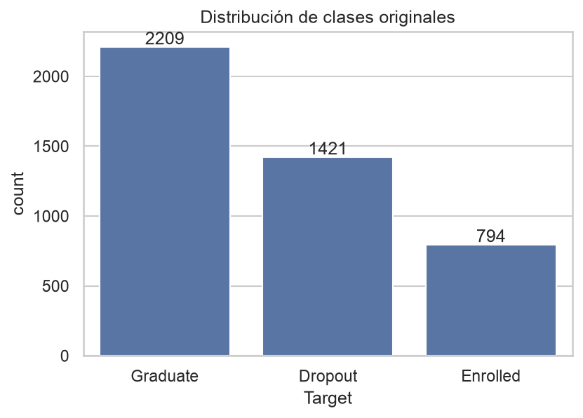
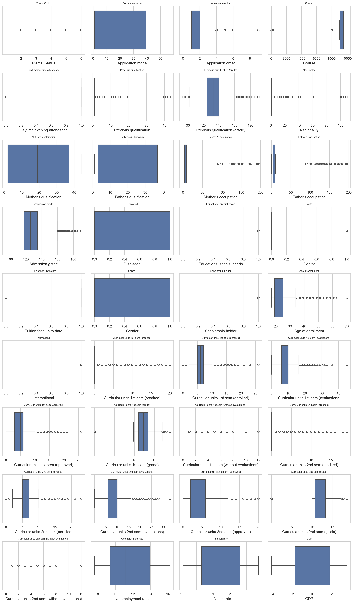
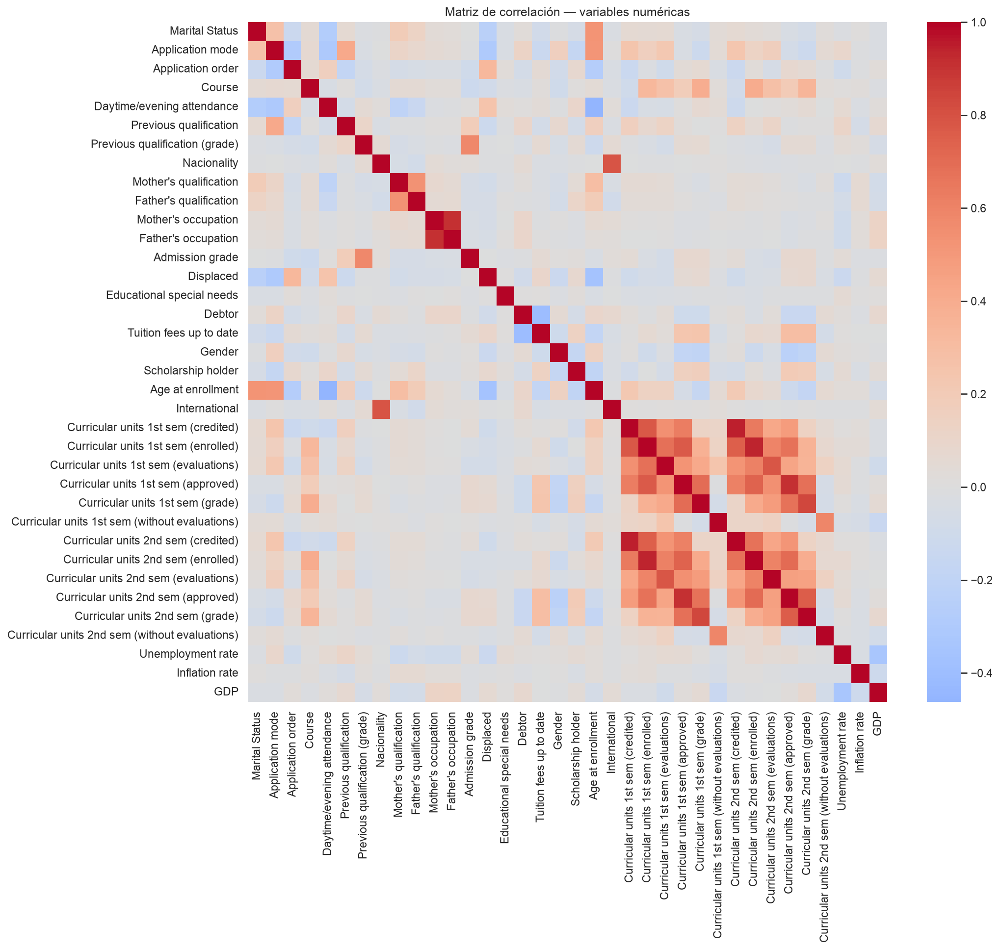
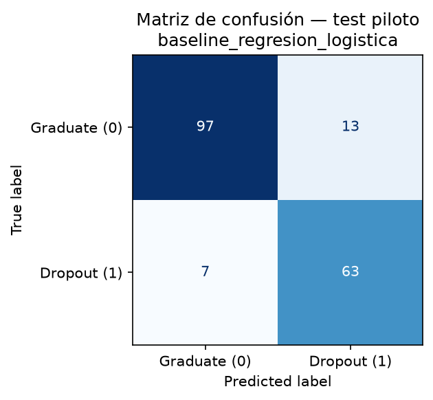
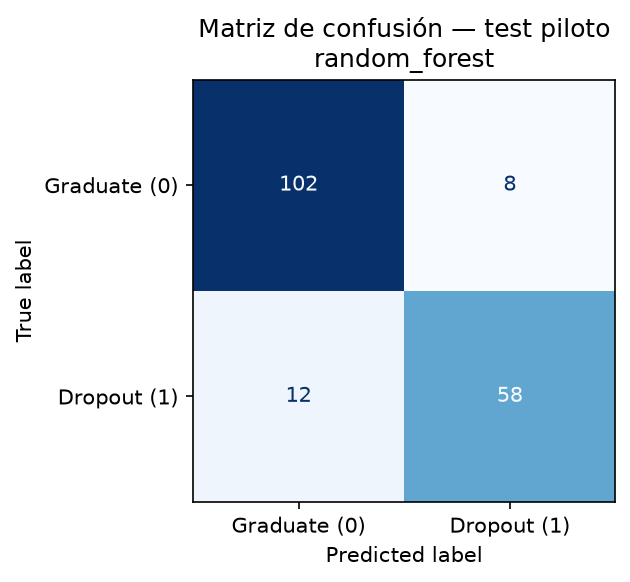

# Notebooks ejecutados — Piloto Semana 4

Recorrido de los 4 notebooks que conforman el piloto, en orden de ejecución, con las
imágenes reales generadas por cada uno. Complementa `Informe_Pilotaje_V1.md` (que es el
documento narrativo A-I) con el detalle de "qué corrió y dónde queda la evidencia
visual". Todos ejecutados en `laptop_arch_linux`, 2026-10-04, **0 errores** en las
4 notebooks (verificado programáticamente, revisando que ninguna celda tenga un output
de tipo `error`), y **reproducidos en Windows 10** (2026-10-08) con paridad exacta de
métricas (ver `comparacion_entornos.md`).

> **Nota de estado (posterior a la ejecución).** Las descripciones por notebook de abajo
> reflejan lo que cada notebook mostró el 2026-10-04 (p. ej. el semáforo interno 🟡 AMARILLO
> de la sección 9 del notebook 01). El **estado final del piloto es 🟢 VERDE**: las
> incidencias se cerraron (ver `Informe_Pilotaje_V1.md`, secciones E e I). En total fueron
> **cuatro** incidencias: INC-01/02/03 en la corrida de la laptop e **INC-04** (SSL) en la
> reproducción en Windows — todas cerradas.

Ubicación de los notebooks:
`Laboratorio de Pruebas/Fase2_Adquisicion_Preparacion/`

Orden de dependencia (cada uno necesita que el anterior ya haya corrido, porque lee los
archivos que el anterior generó en `Pilotaje/laptop_arch_linux/evidencias/`):

```
01_Adquisicion_EDA.ipynb
        │  genera dataset_split_piloto.csv, pipeline_config_piloto.json
        ▼
02_Piloto_Baseline_RegresionLogistica.ipynb   03_Piloto_RandomForest.ipynb
        │  (independientes entre sí, ambos leen 01)
        ▼
04_Piloto_Evaluacion_Test.ipynb   (lee 01; reentrana los modelos; necesita que 02/03 hayan corrido al menos una vez antes, conceptualmente, aunque técnicamente reentrana por su cuenta)
```

---

## 1. `01_Adquisicion_EDA.ipynb` — Adquisición, EDA, muestra y partición piloto

**Protocolo ejercitado:** P01 (registro), P02 (auditoría), P03 (control de fuga), P04 y
P05 ejercitados sobre una muestra piloto (ver `Informe_Pilotaje_V1.md`, sección C.2).

**39 celdas.** Secciones:

| Sección | Qué hace | Evidencia |
|---|---|---|
| 0. Entorno | Detecta el sistema operativo (Linux/Windows) y fija las rutas de `Pilotaje/<entorno>/` automáticamente — el mismo notebook corre sin cambios en ambas máquinas | — |
| 1. Adquisición (P01) | Descarga el dataset UCI id=697 vía `ucimlrepo`, verifica registros (4,424, OK) y variables (36, **discrepancia** contra las 35 documentadas — INC-02) | `dataset_metadata.csv`, `data/raw/dataset_crudo_uci697.csv` |
| 2. EDA — distribución de clases | Cuenta y grafica las 3 clases originales | `figuras/distribucion_clases.png` (abajo) |
| 2.1 Auditoría — fuga (P03) | Verifica 0 filas duplicadas y `student_id` único (4,424/4,424) | — |
| 3. EDA — faltantes | 0 valores faltantes en las 36 variables | — |
| 4. EDA — outliers | Boxplots de las 36 variables numéricas + conteo IQR (28 variables con >5 outliers) | `figuras/outliers_boxplots.png` (abajo) |
| 5. EDA — correlaciones | Matriz de correlación entre variables numéricas | `figuras/matriz_correlacion.png` (abajo) |
| 6. Auditoría consolidada (P02) | Junta todo lo anterior en un resumen único | `dataset_audit.csv` |
| 7. Resumen EDA | Plantilla para completar manualmente en el informe formal de Fase 2 (no se llena en el piloto, es de la Fase 2 definitiva) | — |
| **8. Piloto Semana 4** | Excluye "Enrolled", binariza, toma muestra estratificada de 1,200 filas (P-01), particiona 70/15/15 (P-02), ajusta `StandardScaler`+`SMOTE` solo en train (P-03), copia evidencia P01-P03 a `Pilotaje/` (P-04) | `dataset_muestra_piloto.csv`, `dataset_split_piloto.csv`, `pipeline_config_piloto.json` |
| 9. Semáforo y síntesis | 🟡 AMARILLO + 12 respuestas (reproducidas en `Informe_Pilotaje_V1.md`, sección I) | — |

### Figuras generadas

**Distribución de clases originales** (`figuras/distribucion_clases.png`):



**Outliers por variable numérica** (`figuras/outliers_boxplots.png`):



**Matriz de correlación** (`figuras/matriz_correlacion.png`):



### Pasos cronometrados (bitácora)

| ID | Acción | Tiempo | Memoria (delta) |
|---|---|---|---|
| P-01 | Excluir "Enrolled", binarizar, muestra estratificada | 0.031s | +1.7MB |
| P-02 | Particionar 70/15/15 estratificada | 0.012s | +0.1MB |
| P-03 | Ajustar StandardScaler + SMOTE sobre train | 0.022s | +1.4MB |
| P-04 | Copiar evidencias P01-P03 a `Pilotaje/` | 0.001s | +0.0MB |

**Puntos donde obedece al protocolo:** `fit` de `StandardScaler` y `SMOTE` ocurre
exclusivamente sobre `X_train_piloto` (celda de la sección 8.3); validación solo se
`transform()`-a, nunca se reajusta — esto es exactamente la regla del Protocolo v2.1 §5
("Todo `fit` únicamente sobre train; `transform` sobre val/test").

---

## 2. `02_Piloto_Baseline_RegresionLogistica.ipynb` — Baseline (P06)

**Protocolo ejercitado:** P06 (baseline Regresión Logística, Protocolo v2.1 §6).

**10 celdas.** Carga `dataset_split_piloto.csv` (no recalcula nada de adquisición/EDA),
reajusta el mismo pipeline (determinista, mismo seed) y entrena
`LogisticRegression(max_iter=1000, random_state=42)` con SMOTE.

| ID (bitácora) | Acción | Tiempo | Memoria (delta) |
|---|---|---|---|
| P-05 | Reajustar StandardScaler + SMOTE sobre train | 0.033s | +3.6MB |
| P-06 | Entrenar baseline y predecir sobre validación | 0.020s | +1.0MB |

**Resultado sobre validación:** AUC-ROC 0.9633, F1 0.8652, recall 0.8592.

**Evidencia:** `baseline_regresion_logistica/baseline_config_piloto.json`,
`metricas_baseline_piloto.json`.

**Puntos donde obedece al protocolo:** usa exactamente el algoritmo y el criterio de
baseline del §6 ("Regresión Logística (baseline)... No se agrega ni quita ninguno... sin
decisión explícita documentada"); las métricas calculadas (AUC-ROC, F1, precisión,
recall, exactitud) son las mismas 5 que exige el §7.

---

## 3. `03_Piloto_RandomForest.ipynb` — Segundo modelo, sin tuning

**Protocolo ejercitado:** ninguno formalmente numerado — es una corrida **adicional, no
oficial**, para confirmar que el pipeline es agnóstico al algoritmo antes de que Fase 4
(P07, con tuning de Optuna) lo use en serio.

**12 celdas.** Mismo patrón que 02, pero con
`RandomForestClassifier(random_state=42)` **sin ningún hiperparámetro ajustado**. La
última celda carga las métricas del baseline (notebook 02) y las compara lado a lado.

| ID (bitácora) | Acción | Tiempo | Memoria (delta) |
|---|---|---|---|
| P-07 | Reajustar StandardScaler + SMOTE sobre train | 0.036s | +3.7MB |
| P-08 | Entrenar Random Forest y predecir sobre validación | 0.165s | +1.5MB |

**Resultado sobre validación:** AUC-ROC 0.9545, F1 0.8429, recall 0.8310 — algo por
debajo del baseline, esperable para un RF sin tuning sobre una muestra chica.

**Evidencia:** `random_forest/rf_config_piloto.json`, `metricas_rf_piloto.json`.

**Puntos donde obedece al protocolo:** el `rf_config_piloto.json` deja escrito de forma
explícita que **no** hay tuning de Optuna y que esto no reemplaza ni adelanta Fase 4
(§11 P07) — exactamente la precaución que pide el material del curso ("no interprete el
piloto como resultado definitivo").

---

## 4. `04_Piloto_Evaluacion_Test.ipynb` — Evaluación final única (P10)

**Protocolo ejercitado:** P04 (regla de test aislado) y P10 (regla de uso único del
test) — sobre el test de la muestra **piloto**, no el test oficial de Fase 5.

**13 celdas.** Carga train/test de `dataset_split_piloto.csv` (nunca antes tocado por
02/03, que solo usaron train/val), reentrana ambos modelos de forma determinista (mismos
hiperparámetros que 02/03) y predice sobre test **una sola vez**, generando matriz de
confusión para cada modelo.

| ID (bitácora) | Acción | Tiempo | Memoria (delta) |
|---|---|---|---|
| P-09 | Reajustar pipeline y reentrenar ambos modelos sobre train | 0.197s | +5.6MB |
| P-10 | Evaluar ambos modelos sobre test (única vez) + matrices de confusión | 0.335s | +8.9MB |

**Resultado sobre test:**

| Modelo | AUC-ROC | F1 | Precisión | Recall | Exactitud |
|---|---|---|---|---|---|
| Regresión Logística | 0.9301 | 0.8630 | 0.8289 | **0.9000** | 0.8889 |
| Random Forest | 0.9451 | 0.8529 | 0.8788 | 0.8286 | 0.8889 |

### Matrices de confusión (test piloto)

**Regresión Logística:**



**Random Forest:**



**Puntos donde obedece al protocolo:** la celda de evaluación (sección 3) contiene una
advertencia explícita en el propio notebook — *"a partir de acá no se vuelve a tocar
`X_test_proc`/`y_test_piloto`"* — que es la aplicación literal de la regla P10 ("cualquier
ajuste posterior a esta evaluación no puede volver a tocar el test; regresa a
validación"). El notebook no reajusta ningún hiperparámetro después de ver el resultado
de test — los hiperparámetros de ambos modelos son idénticos a los ya fijados en 02 y 03,
antes de ver el test.

---

## Resumen de bitácora completa (los 4 notebooks, 1 sola tabla)

| ID | Notebook | Acción | Tiempo | Resultado |
|---|---|---|---|---|
| P-01 | 01 | Muestra piloto estratificada | 0.031s | OK |
| P-02 | 01 | Partición 70/15/15 | 0.012s | OK |
| P-03 | 01 | Pipeline (escalado+SMOTE) | 0.022s | OK |
| P-04 | 01 | Copiar evidencia P01-P03 | 0.001s | OK |
| P-05 | 02 | Reajustar pipeline | 0.033s | OK |
| P-06 | 02 | Entrenar baseline (val) | 0.020s | OK |
| P-07 | 03 | Reajustar pipeline | 0.036s | OK |
| P-08 | 03 | Entrenar Random Forest (val) | 0.165s | OK |
| P-09 | 04 | Reentrenar ambos modelos | 0.197s | OK |
| P-10 | 04 | Evaluar sobre test + matrices | 0.335s | OK |

**10/10 pasos en "OK", 0 incidencias técnicas durante la ejecución del código en la laptop
(Arch Linux)**. De las cuatro incidencias del piloto, INC-01/INC-02/INC-03 son de
documentación/entorno (no fallas del pipeline), e INC-04 apareció en la reproducción en
Windows (descarga SSL vía `pandas.read_csv`, resuelta con `SSL_CERT_FILE`→`certifi`; ver
`comparacion_entornos.md`). Tiempo total medido de los pasos instrumentados: 0.852
segundos — el pipeline completo, sobre la muestra piloto, es rápido incluso sin GPU.
